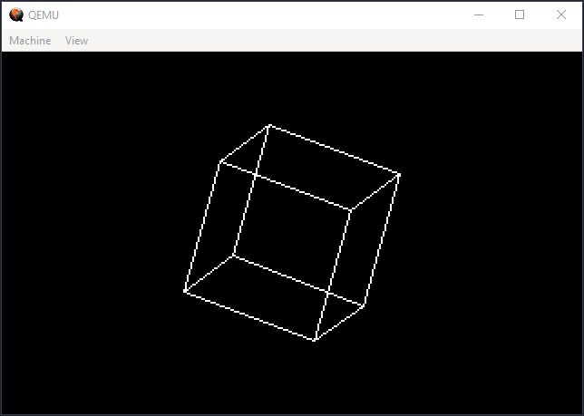

# 3D-Cube
C++ Kernel 3D Rotating Cube made from scratch using Mode 13h's Video Mode. The version that draws only the edges can fit in 3584 bytes (7 sectors).



# Environment Setup
If you just want to run the `Cube.img` available file, make sure to have [qemu-system-i386](https://www.qemu.org/download/). If you don't have, you still can run it by using VMware or VirtualBox, just boot up with the floopy.

<b>Command for qemu:</b>
```
qemu-system-i386 -drive format=raw,file="Cube.img"
```

Otherwise, if you want to compile it, you'll need [i386 ELF GCC](https://github.com/mell-o-tron/MellOs/blob/main/A_Setup/setup-gcc-debian.sh) and [NASM](https://www.nasm.us/). So then run the `make.sh` script and after that, load the `Cube.img` using qemu-system-i386 or any other VM you want!

# Common Problems
* If you modified the kernel and the program doesn't work anymore, look at the binary's size, it may exceeded the 8 allowed sectors. If that happens just change the `SECTRS` size in the [stg2.asm](./Bootloader/stg2.asm).
* If the program is too slow or too fast, you'll need to change the angles values at [kernel.cpp](./Kernel/kernel.cpp) or change the time at `Delay();` function.
